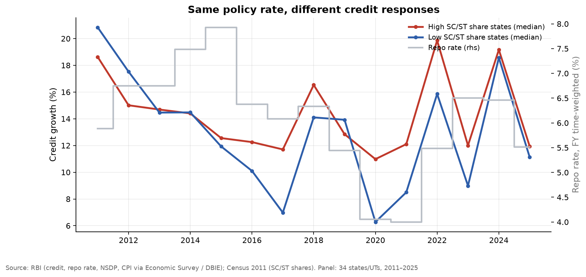
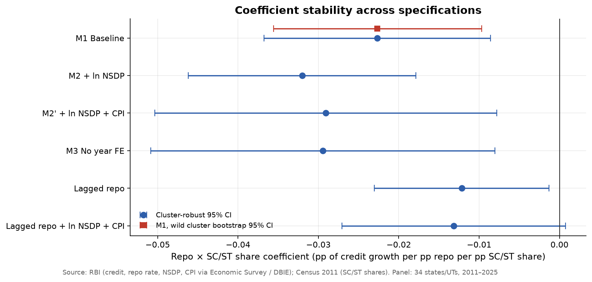
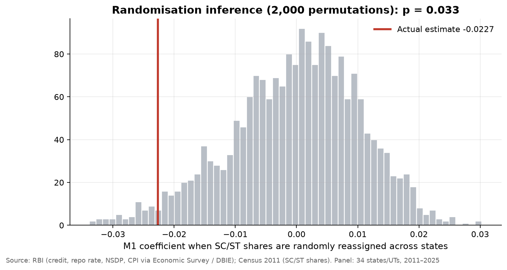
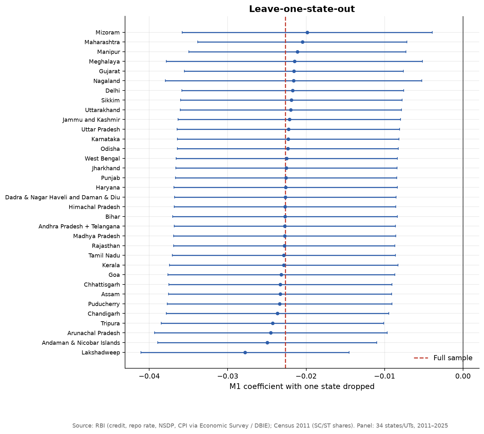
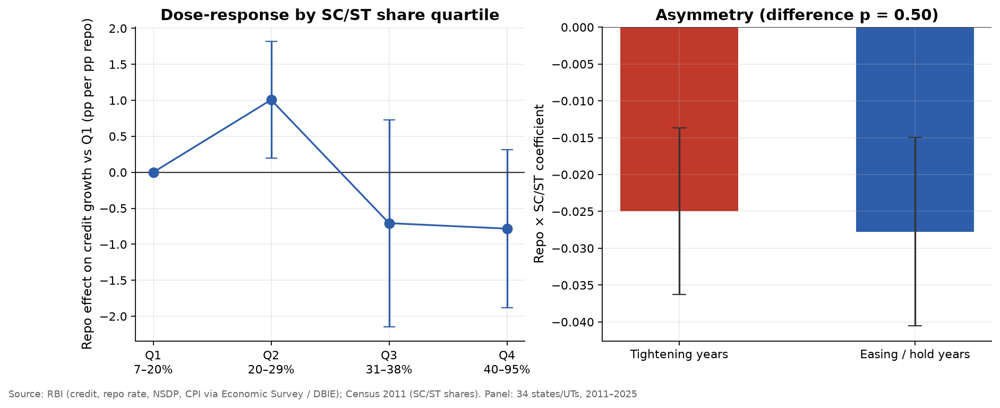

# Caste and Monetary Transmission in India

**Heterogeneous Monetary Policy Transmission in Segmented Credit Markets: The Role of Caste in India**
Meetanshi Gaba · MSc Economics (Data Analytics), Symbiosis School of Economics · Advanced Macroeconomics II

This repository contains the replication package and extensions for my paper.

Monetary policy is meant to reach the whole economy through the banking system, but in India access to formal credit is unequal. Scheduled Castes and Scheduled Tribes (SC/ST) face credit gaps that persist even after controlling for income, education and assets. If a large part of a state's population is only partly connected to formal credit, the same RBI rate change should reach that state's credit market differently. This is the logic of heterogeneous-agent (TANK/HANK) models, applied to a measurable feature of Indian society.

## Design: a continuous-treatment difference-in-differences

Every state faces the **same** repo rate, but states differ in **exposure**: their SC/ST population share (Census 2011). With state and year fixed effects, the only variation left is the interaction:

```
CreditGrowth_st = β (Repo_t × SCST_s) + controls_st + α_s + γ_t + ε_st
```

- `α_s` absorbs everything fixed about a state (size, geography, banking history)
- `γ_t` absorbs everything common to a year, including the level of the repo rate itself
- `β` asks whether states with higher SC/ST shares respond differently to the same policy rate

This is a difference-in-differences with continuous treatment intensity (Callaway, Goodman-Bacon & Sant'Anna 2024). SEs are clustered by state.

## Data

`data_clean.csv` is the cleaned state-level dataset built for the paper: 34 states/UTs, FY2011–FY2025. Andhra Pradesh and Telangana are merged, as are Dadra & Nagar Haveli and Daman & Diu.

| Variable | Source |
|---|---|
| Outstanding SCB credit by state (growth rate) | RBI / Economic Survey Statistical Appendix |
| Repo rate, fiscal-year time-weighted average | RBI DBIE, weekly macroeconomic indicators |
| SC and ST population shares | Census of India 2011 (Primary Census Abstract) |
| Net State Domestic Product (per capita) | RBI Handbook of Statistics on Indian States |
| State CPI inflation | RBI DBIE |

`run.py` reshapes the data to a long panel (`data/panel_long.csv`) and runs everything below.

## Results
<!-- RESULTS:START -->
_Auto-generated by `run.py` on 2026-09-25. Numbers refresh whenever the pipeline re-runs._

### Headline numbers

- **Baseline (M1):** Repo × SC/ST = **-0.0227** (cluster SE 0.0072, p = 0.002; N = 510).
- **Wasted multiplier:** at the mean SC/ST share (35.5%), a 1 pp higher repo rate is associated with credit growth **0.81 pp** lower than in a state with no SC/ST population (wild-bootstrap 95% CI -1.26 to -0.34).
- **Wild cluster bootstrap** (Webb weights, 1,999 draws, 34 clusters): p = **0.007** for M1; **0.006** with ln NSDP (M2).
- **Randomisation inference:** only **3.3%** of 2,000 random reassignments of SC/ST shares produce an estimate as large as the real one.
- **Leave-one-state-out:** estimates range from **-0.0278** to **-0.0198**; 34 of 34 stay significant at 5%.
- **Dose-response:** relative to the lowest-share quartile, the repo effect is Q2 +1.01 (p = 0.02), Q3 -0.71 (p = 0.34), Q4 -0.78 (p = 0.16).
- **Asymmetry:** tightening years -0.0250 vs easing/hold years -0.0278 (difference p = 0.50).
- Random effects (for comparison): Repo × SC/ST = **+0.0085** (p = 0.007). RE assumes state effects are uncorrelated with SC/ST share; the sign flip versus FE is evidence that assumption fails.

### Part A — replication of the paper

| Model | Repo × SC/ST | SE (cluster) | p | 95% CI low | 95% CI high | N |
|---|---|---|---|---|---|---|
| M1 Baseline | -0.0227 | 0.0072 | 0.0016 | -0.0368 | -0.0086 | 510 |
| M2 + ln NSDP | -0.0320 | 0.0072 | 0.0000 | -0.0462 | -0.0179 | 439 |
| M2' + ln NSDP + CPI | -0.0291 | 0.0109 | 0.0074 | -0.0504 | -0.0078 | 343 |
| M3 No year FE | -0.0294 | 0.0109 | 0.0070 | -0.0508 | -0.0080 | 343 |
| Lagged repo | -0.0122 | 0.0055 | 0.0283 | -0.0230 | -0.0013 | 510 |
| Lagged repo + ln NSDP + CPI | -0.0132 | 0.0071 | 0.0635 | -0.0271 | 0.0007 | 343 |

M3 also identifies the level effect of the repo rate: **+1.892** (p = 0.000).

### Figures

**High vs low SC/ST share states**



**Coefficient stability**



**Randomisation inference**



**Leave-one-state-out**



**Dose-response and tightening/easing asymmetry**



<!-- RESULTS:END -->

## What was added beyond the paper

| Check | Why it matters |
|---|---|
| **Wild cluster bootstrap** (Webb weights, restricted residuals) | With 34 clusters, conventional clustered SEs can over-reject (Cameron, Gelbach & Miller 2008). This is the standard fix. |
| **Randomisation inference** | Randomly reassigns SC/ST shares across states 2,000 times. It asks whether a coefficient this large could arise from an arbitrary assignment of shares. |
| **Leave-one-state-out** | Tests whether any single state, such as a North-Eastern state with a 90%+ ST share, drives the result. |
| **Dose-response by quartile** | Drops the assumption that the effect is linear in SC/ST share. |
| **Tightening vs easing** | Tests whether the heterogeneity differs when the RBI raises rates versus when it cuts or holds. |
| **Wasted multiplier with a confidence interval** | Adds a bootstrap interval to the paper's point estimate of about 0.81 pp. |

## Reading the results

- The **replication** matches the paper exactly for M1 (−0.0227), M2 with ln NSDP (−0.0320) and M3 (−0.0294 vs −0.0295). The lagged model gives −0.012 to −0.013, against −0.0134 in the paper. It is significant at 5% without controls and at 10% with them.
- **Inference survives the stricter tests.** The wild cluster bootstrap and randomisation inference both reject a zero effect, and no single state drives the result.
- **The effect is not linear in SC/ST share.** The quartile estimates are imprecise and not monotonic, so the linear interaction is best read as an average gradient. The highest-share quartile is dominated by small North-Eastern economies, which is a caution for extrapolating.
- **There is no evidence of asymmetry** between tightening and easing years.
- **How to read the sign.** Because year fixed effects absorb the repo level, β is *relative*: in years when the repo rate is higher, credit growth in high-SC/ST states is lower relative to low-SC/ST states. M3 shows credit growth and the repo rate co-move positively at the aggregate level (both follow the credit cycle), so the "wasted multiplier" is the gap in that co-movement between a state with average SC/ST share and one with none.

## Reproduce
```bash
pip install -r requirements.txt
python run.py      # ~5 seconds; rewrites outputs/ and the Results section above
```

## Limitations
- SC/ST shares come from Census 2011 and are fixed over the sample, so identification relies entirely on repo-rate variation over time interacting with fixed cross-state differences.
- SC/ST share is a proxy for exposure to credit exclusion. It may also pick up other features of high-share states, such as rurality and sector mix, that change how credit responds to rates. Interacting the repo rate with those characteristics as well is the natural next step.
- Formal credit data miss informal lending, which matters most for excluded households.
- The paper's M4 (bank branches per lakh) is not reproduced here because branch data are not in this dataset.
- Annual data give 15 time periods. RBI's quarterly state credit data (Table 2.2, split into rural, semi-urban, urban and metro, and into small borrowal accounts) would allow a sharper mechanism test in future work.

## References
- Galí, J., López-Salido, J. D. & Vallés, J. (2007). *Understanding the effects of government spending on consumption.* JEEA.
- Debortoli, D. & Galí, J. (2024). *Heterogeneity and aggregate fluctuations: insights from TANK models.* NBER Macroeconomics Annual.
- Kaplan, G., Moll, B. & Violante, G. (2018). *Monetary policy according to HANK.* AER.
- Cameron, A. C., Gelbach, J. & Miller, D. (2008). *Bootstrap-based improvements for inference with clustered errors.* REStat.
- Webb, M. (2023). *Reworking wild bootstrap-based inference for clustered errors.* Canadian Journal of Economics.
- Callaway, B., Goodman-Bacon, A. & Sant'Anna, P. (2024). *Difference-in-differences with a continuous treatment.* NBER WP 32117.
